# BSv3.2 Supervisory Platform — Architecture

## Service Architecture Diagram

```mermaid
flowchart TB
    subgraph Execution["BSv3.2 Execution Layer (READ-ONLY)"]
        BSv32["BSv3.2 Engine v3.2"]
        Filters["Deterministic Filters"]
        MT5["MT5 Bridge"]
        BSv32 --> Filters
        Filters --> MT5
    end

    subgraph External["External APIs (Read-Only)"]
        Desk["Desk API"]
        FBot["Forward Bot API"]
        WD["Watchdog API"]
    end

    subgraph Platform["JCM Supervisory Platform"]
        Ingest["Event Ingestion API"]
        Pipeline["Event Pipeline"]
        Redis["Redis Pub/Sub"]
        PG["PostgreSQL"]

        subgraph Agents["8 Supervisory Agents"]
            QM["Quant Memory"]
            PI["Performance Intel"]
            IR["Infra Resilience"]
            PR["Portfolio Risk"]
            EQ["Execution Quality"]
            EX["Explainability"]
            RE["Research Evolution"]
            CEO["CEO Copilot"]
        end

        API["FastAPI"]
        WS["WebSocket /ws"]
        Prom["Prometheus /metrics"]
        Dash["Next.js Dashboard"]
    end

    BSv32 -->|"webhook events"| Ingest
    MT5 --> Desk
    BSv32 --> FBot
    WD --> IR

    Ingest --> Pipeline
    Pipeline --> QM
    Pipeline --> EX
    Pipeline --> EQ
    QM --> PG
    PI --> PG
    IR --> PG
    PR --> PG
    EQ --> PG
    EX --> PG
    RE --> PG
    CEO --> PG

    Pipeline --> Redis
    Redis --> WS
    WS --> Dash
    API --> Dash

    PR -.->|"lot_scaling info only"| Redis
    Redis -.->|"informational input"| BSv32

    style BSv32 fill:#1a365d,stroke:#63b3ed
    style Platform fill:#1a202c,stroke:#48bb78
    style Execution fill:#2d3748,stroke:#ed8936
```

## Data Flow

1. **BSv3.2 engine** emits trade/filter/system events via webhook to `/ingest/event`
2. **Event Pipeline** routes to Quant Memory (persist), Explainability (audit), Execution Quality (metrics)
3. **Background scheduler** runs agent cycles on configured intervals
4. **Redis pub/sub** pushes real-time updates to WebSocket clients
5. **CEO Dashboard** polls REST endpoints and subscribes to WebSocket for live panels

## Non-Negotiable Boundaries

| Component | Can Do | Cannot Do |
|-----------|--------|-----------|
| All Agents | Observe, record, analyze, alert | Override BSv3.2 filters |
| Portfolio Risk | Recommend lot scaling | Force position changes |
| Research Evolution | Queue findings for review | Auto-deploy strategy changes |
| Infra Resilience | Restart services via Watchdog | Modify BSv3.2 logic |
| Explainability | Generate audit explanations | Alter trade decisions |

## Agent Schedule (Default)

| Agent | Interval |
|-------|----------|
| Infrastructure Resilience | 30s |
| Portfolio Risk | 60s |
| CEO Copilot | 5min |
| Quant Memory | 5min |
| Execution Quality | 2min |
| Explainability | 10min |
| Performance Intelligence | 1hr |
| Research Evolution | 2hr |
